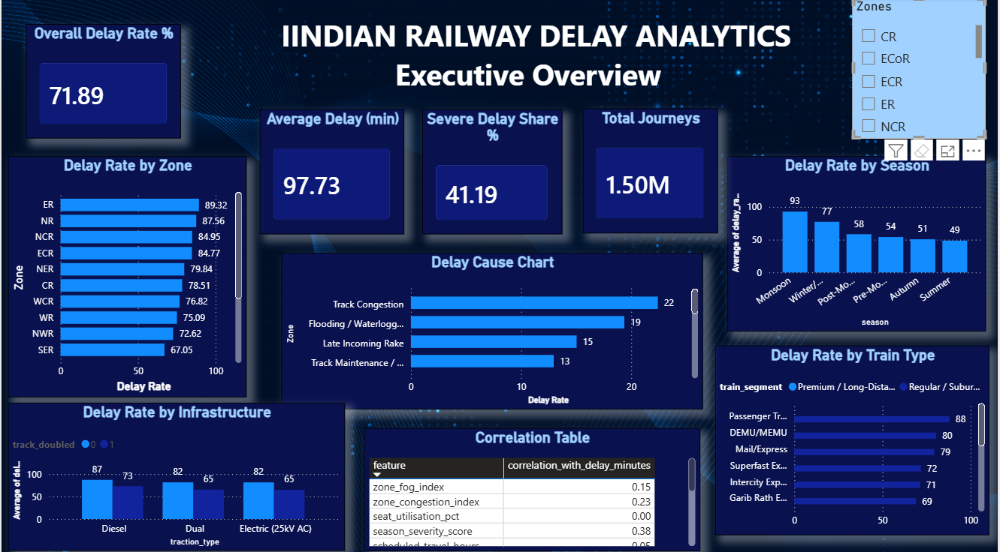

# Indian Railway Delay  Analytics

##  Project Overview

An end-to-end **Data Analytics / Business Analytics portfolio project** analyzing **1.5 million simulated railway journeys** to understand journey delays, operational bottlenecks, seasonal patterns, train-type performance, infrastructure associations, and major recorded delay causes.

The project follows a practical analytics workflow:

**Python → Data Cleaning & EDA → SQL (DuckDB) → Business Analysis → Power BI Dashboard → Business Insights**


##  Business Objective

The project answers key operational questions such as:

- Which railway zones have the highest delay rates?
- Which train types show higher delay rates?
- How does seasonality affect delays?
- Does infrastructure configuration relate to delay performance?
- Which recorded causes account for the largest share of delayed journeys?
- Does time of day meaningfully affect delay likelihood?
- Where should operations teams prioritize further investigation?

---

##  Dataset

- **Records:** 1,500,000 journeys
- **Columns:** 45
- **Period:** January 2018 – December 2024
- **Missing values:** 0
- **Duplicate rows:** 0
- **Zones:** 16
- **Target variables:** `is_delayed`, `delay_minutes`
- **Dataset type:** Synthetic / simulated

Key attributes include railway zone, train type, departure timing, season, distance, infrastructure indicators, congestion/risk scores, late incoming rake indicators, and recorded delay causes.

---

##  Tools & Technologies

- **Python**
- **Pandas**
- **NumPy**
- **Matplotlib**
- **Seaborn**
- **SQL**
- **DuckDB**
- **Power BI**
- **Statistical Analysis**

---

##  Project Workflow

### 1. Data Loading & Quality Audit
Loaded the journey-level dataset and checked shape, data types, missing values, duplicates, date range, and value consistency.

### 2. Data Cleaning
Standardized data types and validated operational and delay-related fields.

### 3. Feature Engineering
Created business-readable analytical features such as:

- Delay categories
- Time-of-day groups
- Distance bands
- Day names
- Route categories

### 4. Exploratory Data Analysis
Used Python visualizations to study delay distributions, zone performance, seasonal patterns, and numeric risk-factor relationships.

### 5. SQL Business Analysis
Used DuckDB to answer business questions involving:

- Zone delay performance
- Seasonality
- Train-type performance
- Time-of-day patterns
- Delay causes
- Infrastructure combinations
- Distance bands
- Train × zone performance

### 6. Power BI Dashboard
Converted analytical outputs into an executive-facing dashboard for operational monitoring and decision support.

---

##  Key Findings

1. Overall delay rate was **71.89%**, with an average delay of **97.73 minutes**.
2. **Eastern Railway (ER)** recorded the highest zone-level delay rate at **89.32%**.
3. **South Western Railway (SWR)** recorded the lowest zone-level delay rate at **50.22%**.
4. **Monsoon** had a delay rate of approximately **92.8%**, compared with **48.6% in Summer**.
5. **Passenger Trains** showed an **88.0%** delay rate, compared with **44.3% for Vande Bharat**.
6. Delay rates were relatively flat across time-of-day windows (**70.9%–74.7%**).
7. Single-track, non-electrified diesel journeys showed an **87.3%** delay rate versus **65.0%** for double-track/electrified journeys.
8. **Track Congestion (22.4%)** and **Flooding/Waterlogging (19.4%)** were among the largest recorded delay causes.
9. No single numeric risk factor dominated the analysis; the strongest correlations with delay were moderate.

> These findings describe associations in the simulated dataset and should not be interpreted as causal effects.

---

## 📊 Power BI Dashboard

The dashboard provides an executive view of railway delay performance, including:

- Overall Delay Rate
- Average Delay
- Severe Delay Share
- Total Journeys
- Delay Rate by Zone
- Delay Rate by Season
- Delay Cause Analysis
- Infrastructure Comparison
- Train-Type Performance
- Correlation Analysis

### Dashboard Preview



---

##  Repository Structure

```text
Railway-Operations-Analytics/
│
├── Documentation/
│   └── IR_Project_Report.docx
│
├── Images/
│   └── dashboard_page1.png
│
├── Python/
│   └── Indian_Railway_Delay_Analysis.ipynb
│
├── .gitignore
└── README.md
```

---

##  Business Analyst Deliverables

The project demonstrates:

- Business problem definition
- Business objectives and KPIs
- Stakeholder analysis
- Data-quality assessment
- Business requirements
- Functional requirements
- User stories and acceptance criteria
- As-Is vs To-Be process
- SQL business analysis
- Dashboard requirements
- Risk considerations
- Business recommendations

---

## 🚀 Business Recommendations

Based on the analysis, the project highlights several areas for operational investigation:

- Prioritize high-delay railway zones for deeper root-cause review.
- Prepare season-specific operating plans for high-risk periods such as Monsoon.
- Investigate infrastructure configurations associated with higher delay rates.
- Focus on recurring operational causes such as congestion and late incoming rakes.
- Use confidence-aware train × zone analysis instead of ranking small groups only by raw delay percentage.

---

##  Important Limitation

This project uses a **synthetic/simulated dataset**. It demonstrates the analytics methodology, business reasoning, SQL analysis, and dashboard development process; it is not an official Indian Railways operational analysis.

The dataset also does not contain cost, revenue, or passenger-count fields, so monetary ROI is not estimated.


